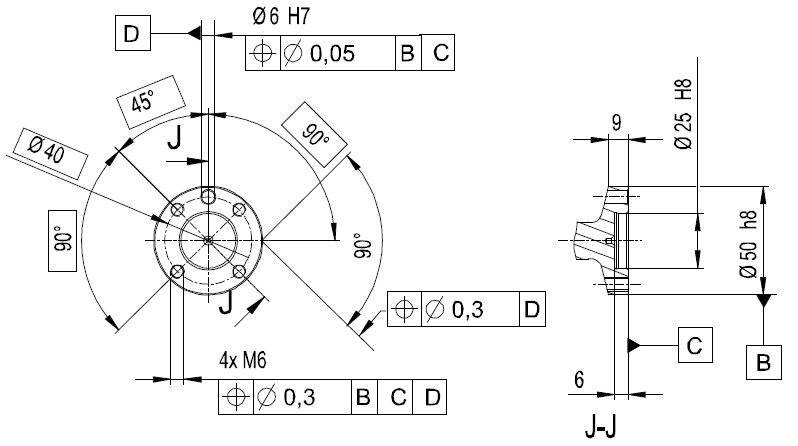
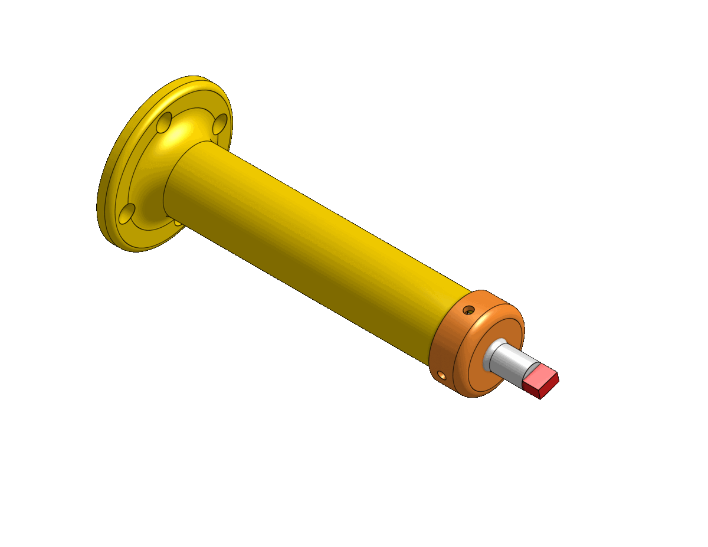
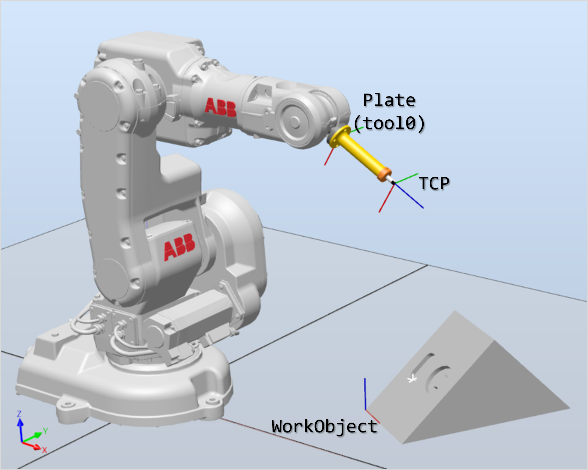
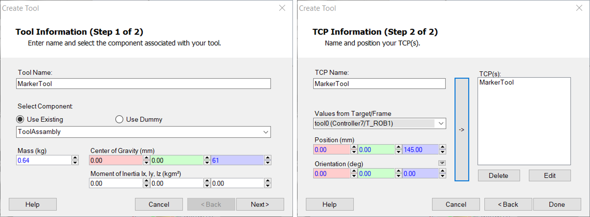
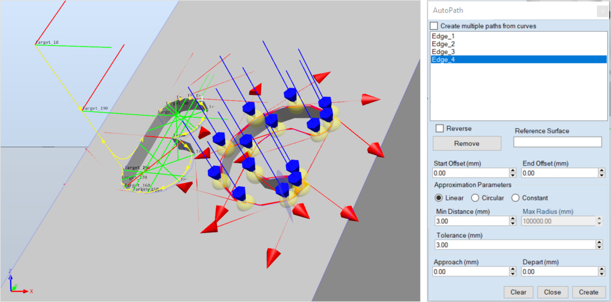
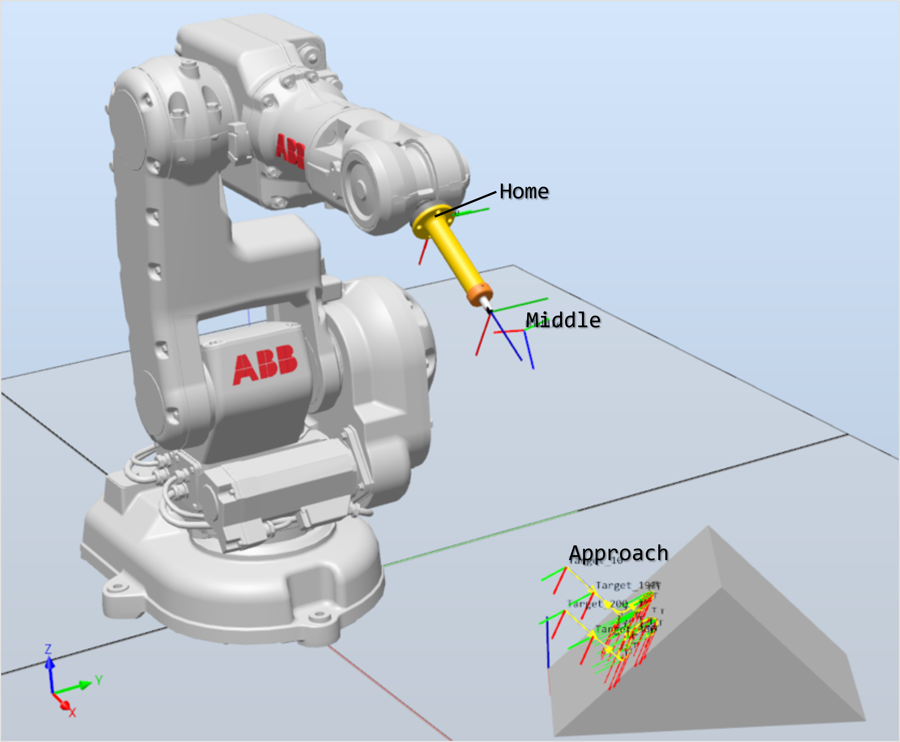
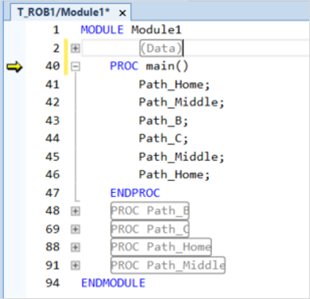

# robotics-lab1
Repositoty for practices with an industrial robot model ABB IRB140

> ## Contributors
> 
> - [Camilo Andrés Borda Gil](https://github.com/Canborda) (caabordagi@unal.edu.co)
> - Paula Sofía Medina Diaz (psmedinadi@unal.edu.co)
> - Robinson Jair Orduxz Gomez (rjorduzg@unal.edu.co)

---
# Tool Design

The goal was to draw on a defined surface with a self-designed tool. To achieve this, we searched on the [product manual](https://library.e.abb.com/public/81a35b138c2342b5b9455e5696a09484/3HAC027400%20PM%20IRB%20140-en.pdf) the dimensions of the mounting flange.

Based on those dimensions, the team designed the tool shown below, made up of four parts: a base and a cap build with 3D printing, a spring and a marker. To see the tool model with more detail go to <a target="_blank" href="https://cad.onshape.com/documents/02a2a5fe444c220951f7859a/w/4de4b01172907f48fb48adbe/e/481b6444fafd2e1357d20adc">Visualize CAD model with OnShape</a>.

The final tool has the following properties:
|   |   |
|---|---|
| __mass__ | $34g$ (parts) + $70g$ (marker) |
| __center of gravity__ | $[0, 0, 61]$ $\text{mm}$ |
| __TCP__ | $[0, 0, 145]$ $\text{mm}$ |

---
# Tool Calibration

The calibration process starts by fixing the tool on the mounting flange with four screws. Next, using the jogging function and the joystick, the TCP (Tool Center Point) must be matched with an external pointed tool in four different configurations of the robot. Once all four positions have been achieved the robot controller will calculate with inverse kinematics the TCP frame offset with respect to the `tool0` frame. The program also shows the error found in the calculation.

> - __Position__: $\{ x=-1.14511, y=-2.77919, z=147.51\}$
> - __Error__: $\{max=1.1265782\text{ mm}, min=0.3530322\text{ mm}, mean=0.6549213\text{ mm}\}$

---
# Simulation
Before any application on an industrial robot, it's mandatory to simulate the process to ensure that all paths the robot will make are safe. For this simulation stage we use [RobotStudio®](https://new.abb.com/products/robotics/robotstudio) software, following these steps:

1. Create a new station and add the robot model [ABB - IRB140](https://new.abb.com/products/3HAC020536-001/irb-140), the created tool (modeled in the _Tool Design_ section) and the work object with the surface to write to. Both tool and object models are imported in `.sat` format (available at [/models](./models) folder).

2. Configure <b>TCP</b> (Tool Center Point) by adding the position and orientation offset with respect to the `tool0` frame. This offset can be obtained from the tool model or via tool calibration as described in the previous section.

3. Generate path with the `AutoPath` tool. It is possible to set the tolerance, the speed and the correction for reduced angles.

4. Create midway points to ensure a safe trajectory for the robot as it approaches to the designed path.

5. Create subroutine on RAPID code by calling the different PROCEDURES into the `main()` function. RobotStudio will create the constants for every targed used in the different paths and will also write every path as an isolated procedure. The final RAPID code is available inside the [/code](./code/Module1.mod) folder.

https://user-images.githubusercontent.com/55401093/188253709-890514b5-370a-47eb-8e7b-e0c88d74943e.mp4

---
# Demonstration

https://user-images.githubusercontent.com/55401093/188254255-55779791-179b-4d6a-8675-2d9d4596900a.mp4

https://user-images.githubusercontent.com/55401093/188256259-78a9372b-4661-4763-ac9e-4cb798e6ed9c.mp4

---
# Conclusions

- Performing a simulation before the real robot implementation allows to solve problems and prevents dangerous situations for both robot and humans. It also helps to study the paths and obtain more complex and more accurate results by simplifying the path planning task and helping with all math inside.
- In the tool design it is important to acknowledge the requirements and limitations of the robot and thus avoid any damage. A tool must only be used in the task it was designed for.
- The precision on the calibration depends mostly on how well defined is the origin of the TCP, in this case, the wide shape of the marker tip made very difficult to find the exact point and that led to a bigger calibration error.
- About the work object calibration, the selection of the calibration points is very important because this will define how hard will be for the robot to follow the path using simple poses and sometimes a point can't be reached by the TCP.

---